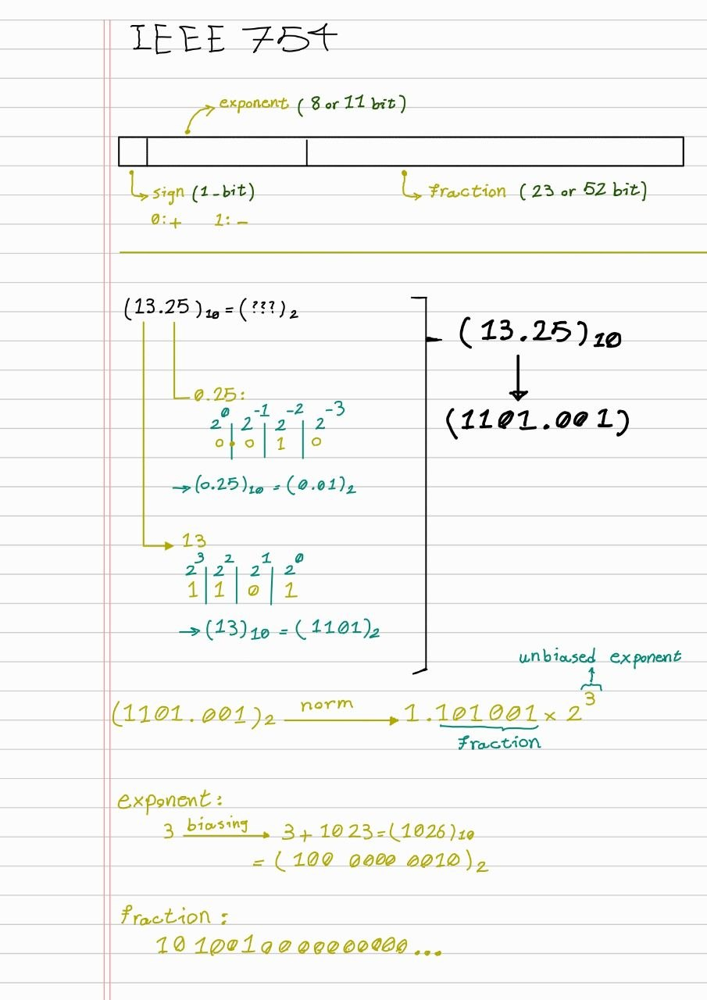

# IEEE754 and double

Here, based on the IEEE 754 standard, we tried to store the value `13.25` in a `double`, bit by bit.

The calculations are as follows:



## How to Compile :

``` bash
➜ gcc main.c ; ./a.out
0100000000101010100000000000000000000000000000000000000000000000
13.250000
➜ clang main.c ; ./a.out 
0100000000101010100000000000000000000000000000000000000000000000
13.250000
```